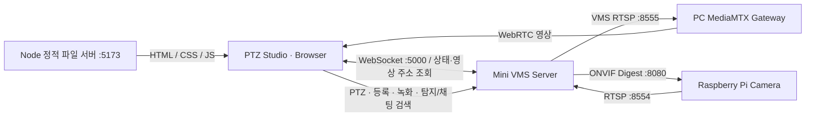
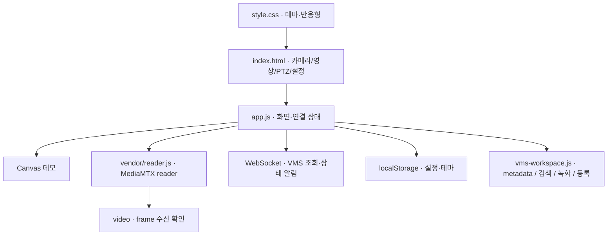

# PTZ Studio Web Client

Qt Mini VMS 화면의 카메라 목록 / 영상 / PTZ 배치를 참고한 브라우저 클라이언트입니다.
현재 VMS 계약에 맞춰 ONVIF 카메라 등록, PTZ, 실시간 메타데이터, 탐지/상태 이력 검색, 녹화 제어·검색, 자연어 검색 화면을 제공합니다.

## 시스템 구조



Node 서버는 정적 파일을 제공합니다. 영상은 VMS의 RTSP를 읽는 PC MediaMTX를 거쳐 WebRTC로 전달됩니다. Web은 Pi에 직접 연결하지 않습니다.

## 코드 구조



```text
PTZ_WEB_Client/
├── index.html             # 화면
├── style.css              # 테마·반응형
├── app.js                 # 데모·WebRTC·VMS·PTZ 입력
├── vms-workspace.js       # 실시간 bbox·이벤트·녹화·채팅·ONVIF 등록
├── server.mjs             # Node 정적 파일 서버
├── package.json           # 실행·테스트 명령
├── package-lock.json      # dependency 잠금
├── vendor/                # WebRTC reader 및 라이선스
├── tests/                 # Playwright UI / mock VMS
└── playwright.config.js   # 테스트 설정
```

## 실행

`import.meta.dirname`을 지원하는 Node.js 20.11 이상에서:

```sh
npm ci
npm run dev
```

브라우저에서 http://localhost:5173 을 엽니다. 처음에는 **데모 모드**이며 Canvas 테스트 패턴만 표시합니다. 방향 버튼을 누르거나 방향키를 누르면 패턴을 이동하고, 놓으면 정지합니다. R은 데모 중앙 복귀입니다. 실제 장치에 명령을 보내지 않습니다.

상단 달/해 버튼으로 화이트 / 다크 테마를 전환합니다. 초기 테마는 화이트이며 테마 및 연결 설정은 브라우저 localStorage에 저장합니다. 좁은 화면에서는 패널을 세로로 배치합니다.

## 실제 영상

톱니바퀴에서 카메라 ID와 VMS WebSocket 주소를 설정하고 데모 모드를 끕니다. GET_WEB_STREAM으로 게이트웨이 주소를 조회합니다.

- 로컬 CAM01 게이트웨이 주소: `http://127.0.0.1:8889/CAM01/whep` (VMS 설정에서 제공)
- 기본 VMS 주소: `ws://127.0.0.1:5000/ws`

이전 저장 설정의 Pi whepUrl은 사용하지 않습니다. 설정 화면에서도 직접 WHEP 입력을 제거했습니다.

MediaMTX 공식 WebRTC reader를 로컬에 포함해 SDP/ICE, 세션 해제 및 재접속을 처리합니다. `video` 요소의 프레임 증가를 확인한 뒤에만 LIVE로 표시합니다. 데모에는 실제 해상도·프레임 통계 값을 만들지 않습니다. 영상 정지, 모드 전환 및 페이지 종료 시 reader/트랙을 해제합니다.

VMS 설정의 webrtc_gateway_url과 PC MediaMTX 실행이 필요합니다. [게이트웨이 실행·새 영상 경로](../PTZ_VMS_Server/docs/LIVE_ROUTING.md). 같은 PC 기본 포트는 WHEP HTTP 8889 / ICE UDP·TCP 8189입니다. HTTPS 웹페이지에서는 HTTPS/WSS 주소를 사용합니다.

공식 참고: https://mediamtx.org/docs/read/web-browsers

## 실제 PTZ 연결 계약

Web 이동 요청은 VMS의 `panVelocity/tiltVelocity` 계약을 사용합니다. ONLINE 상태와 `capabilities.ptz=true`일 때 제어를 활성화하며 기본 속도는 0.3입니다.

- `GET_CAMERA_LIST`, `GET_CAMERA_STATUS`, `CAMERA_STATUS` 알림
- `version: 1`, 문자열 `requestId`, `command`, `cameraId`
- 응답 `type: "response"`, `ok`, `data` 또는 `error`

VMS가 요구하는 필드는 `panVelocity/tiltVelocity`입니다. 값은 -1..1이며 위쪽은 양의 tilt입니다.

```json
{"version":1,"requestId":"3","command":"PTZ_MOVE","cameraId":"CAM01","panVelocity":0.3,"tiltVelocity":0}
{"version":1,"requestId":"4","command":"PTZ_STOP","cameraId":"CAM01"}
{"version":1,"requestId":"5","command":"PTZ_CENTER","cameraId":"CAM01"}
```

현재 Web 동작:

- 누르는 동안 약 200ms마다 MOVE 갱신, 놓으면 STOP 요청.
- VMS의 ACCEPTED 응답과 같은 requestId의 PTZ_RESULT 알림을 구분합니다.
- PI_ACKNOWLEDGED는 ONVIF 응답이며 모터 도착 완료가 아닙니다. FAILED/SUPERSEDED도 처리해야 합니다.
- 서버의 ptzCenter capability에 따라 중앙 버튼/R 키를 PTZ_CENTER로 연결합니다.

실제 장비의 Web PTZ 구동은 검증하지 않았습니다. VMS는 PT1S timeout, 600ms 갱신 lease 및 연결 단절 시 Stop 시도를 구현했습니다.

버튼 release/cancel, 키 해제, 창 focus 이탈, 탭 숨김, 카메라/모드 전환 시 정지를 요청합니다. 소켓이 이미 끊긴 경우 정지 명령 전달은 보장되지 않습니다. 현재 VMS에는 세션 종료 및 이동 lease 만료 시 Stop 처리가 구현되어 있습니다. 웹의 응답 시간 초과 또는 이동 오류 시 제어를 비활성화합니다. 브라우저는 Qt legacy의 raw TCP `PTZ:LEFT` 프로토콜에 직접 연결하지 않습니다.

영상 연결과 PTZ 연결은 독립적입니다. 각 카메라의 WHEP 주소는 설정에서 지정해야 합니다. 카메라 목록에서 다른 카메라를 선택하면 기존 영상을 정지하여 잘못된 카메라 영상이 남지 않게 합니다.

## 검증

```sh
npx playwright install chromium
npm test
```

Playwright로 테마·데모·모바일 표시, 최신 PTZ 명령·200ms 갱신·정지·Pi 응답·중앙 복귀, nullable 메타데이터·만료·카메라 격리, 검색 필터·페이지네이션·녹화 연결, 채팅·오류·이전 응답 무시, 등록·녹화 API를 검사합니다. 모의 서버 기반 테스트이며 실제 영상·서보·장시간 시험은 사용자가 수행합니다.

## VMS 기능 화면

- **실시간 정보**: nullable topic 병합·영상 기준 bbox·2초 만료. 자동 추적 ON/OFF는 capabilities.tracking 확인 후 요청하며 실제 상태는 Pi metadata로 확인합니다. Pi 응답만으로 ON으로 표시하지 않습니다.
- **탐지 검색**: GET_DETECTIONS / GET_EVENTS, 한국 시간 범위·종류·confidence 필터, cursor 페이지네이션. Web 재생 버튼·위치 조회는 없습니다.
- **녹화**: START_RECORDING / STOP_RECORDING, GET_RECORDINGS. 완료된 segment만 조회하며 한 번에 최대 100개입니다.
- **채팅 검색**: CHAT_SEARCH, timezone=Asia/Seoul, 45초 timeout, clarify/unsupported/error/다음 페이지/결과 선택. Gemini 키는 Web에 저장하지 않습니다.
- **카메라 등록**: DISCOVER_CAMERAS → 장치 선택 → REGISTER_CAMERA. 계정은 VMS 서버 설정을 사용합니다.

**녹화 영상 재생은 Qt 전용입니다.** Web의 녹화 제어·목록 조회는 유지하고 검색 결과의 재생 버튼·offsetMs 표시를 제거했습니다. 라이브 영상은 VMS → PC MediaMTX → WebRTC로 연결합니다.

[API·검증 범위](docs/VMS_INTEGRATION.md)

`SESSION_SUMMARY.md`는 작성 시점의 기록입니다. 이후 추가된 서버 PTZ 등 현재 기능은 이 README와 소스를 기준으로 확인합니다.

## 관련 프로젝트

| 저장소 | 역할 |
|---|---|
| [PTZ_VMS_Server](https://github.com/PTZ-CAMERA/PTZ_VMS_Server) | 카메라 수신·RTSP TCP/UDP 중계·녹화·ONVIF PTZ |
| [Qt_Client](https://github.com/PTZ-CAMERA/Qt_Client) | VMS를 사용하는 Qt 데스크톱 클라이언트 |
| [PTZ_WEB_Client](https://github.com/PTZ-CAMERA/PTZ_WEB_Client) | WebRTC 영상·PTZ용 브라우저 화면 |

## 외부 코드

`vendor/reader.js`: bluenviron/mediamtx 공식 저장소에서 2026-10-07에 가져온 WebRTC reader. 라이선스는 `vendor/MEDIAMTX-LICENSE`에 보존했습니다. 외부 CDN 없이 포함합니다. 화면의 웹 폰트는 Google Fonts를 사용하며 네트워크가 없으면 시스템 폰트로 표시합니다.
